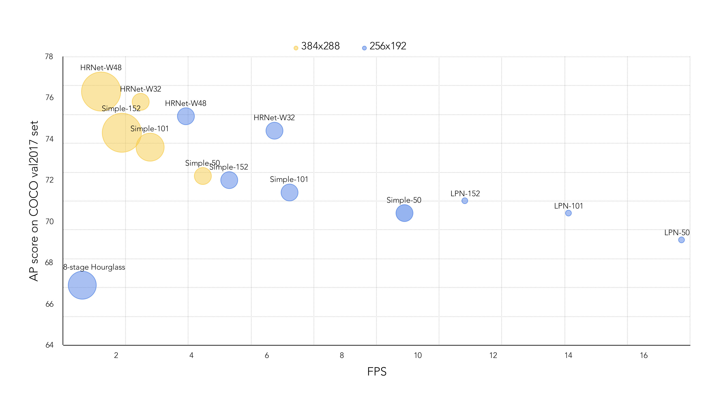

# Simple and Lightweight Human Pose Estimation
## Introduction
This is an official pytorch implementation of [*Simple and Lightweight Human Pose Estimation*](https://arxiv.org/abs/1911.10346). The codes are developed based on the repository of [HRNet](https://github.com/leoxiaobin/deep-high-resolution-net.pytorch).

## Experimental Results
### Results on MPII val set
| Method | #Params | FLOPs | Head | Shoulder | Elbow | Wrist |  Hip | Knee | Ankle | Mean | Mean@0.1 |
|--------|--------:|------:|:----:|:--------:|:-----:|:-----:|:----:|:----:|:-----:|:----:|:--------:|
| pose_resnet_50[<sup>1</sup>](#refer-anchor) | 34.0M | 12.0G | 96.4 | 95.3 | 89.0 | 83.2 | 88.4 | 84.0 | 79.6 | 88.5 | 34.0 |
| lpn_50 | 2.9M | 1.3G | 96.56 | 95.33 | 88.51 | 83.50 | 88.84 | 84.00 | 79.81 | 88.64 | 34.12  |

### Note:
- Flip test is used.
- Input size is 256x256.

### Results on COCO val2017 with detector having human AP of 56.4 on COCO val2017 dataset
| Method                                       | #Params | FLOPs |    AP | Ap .5 | AP .75 | AP (M) | AP (L) |    AR | AR .5 | AR .75 | AR (M) | AR (L) |
|----------------------------------------------|---------|-------|:-----:|:-----:|:------:|:------:|:------:|:-----:|:-----:|:------:|:------:|:------:|
| pose_resnet_50[<sup>1</sup>](#refer-anchor)  |  34.0M  |  8.9G | 0.704 | 0.886 |  0.783 |  0.671 |  0.772 | 0.763 | 0.929 |  0.834 |  0.721 |  0.824 |
| pose_resnet_101[<sup>1</sup>](#refer-anchor) |  53.0M  | 12.4G | 0.714 | 0.893 |  0.793 |  0.681 |  0.781 | 0.771 | 0.934 |  0.840 |  0.730 |  0.832 |
| pose_resnet_152[<sup>1</sup>](#refer-anchor) |  68.6M  | 15.7G | 0.720 | 0.893 |  0.798 |  0.687 |  0.789 | 0.778 | 0.934 |  0.846 |  0.736 |  0.839 |
| pose_hrnet_w32[<sup>2</sup>](#refer-anchor)  |  28.5M  |  7.1G | 0.744 | 0.905 |  0.819 |  0.708 |  0.810 | 0.798 | 0.942 |  0.865 |  0.757 |  0.858 |
| pose_hrnet_w48[<sup>2</sup>](#refer-anchor)  |  63.6M  | 14.6G | 0.751 | 0.906 |  0.822 |  0.715 |  0.818 | 0.804 | 0.943 |  0.867 |  0.762 |  0.864 |
| lpn_50                                       |   2.9M  |  1.0G | 0.691 | 0.881 |  0.766 |  0.659 |  0.757 | 0.749 | 0.923 |  0.818 |  0.707 |  0.810 |
| lpn_101                                      |   5.3M  |  1.4G | 0.704 | 0.886 |  0.781 |  0.672 |  0.772 | 0.762 | 0.929 |  0.831 |  0.721 |  0.822 |
| lpn_152                                      |   7.4M  |  1.8G | 0.710 | 0.892 |  0.786 |  0.678 |  0.777 | 0.768 | 0.933 |  0.834 |  0.726 |  0.827 |

### Note:
- Flip test is used.
- Input size is 256x192.

### Inference Speed on Intel I7-8700K CPU


### Note:
- Flip test is used when testing the inference speed.
- For **higher** FPS, you can make the FLIP_TEST false.

## Installation and Preparation
Please refer to HRNet's [quick start](https://github.com/leoxiaobin/deep-high-resolution-net.pytorch)

## Test
#### Testing on MPII dataset using model zoo's models([GoogleDrive](https://drive.google.com/drive/folders/1_VuLzWXeKg-Lzu54HfZQsMGUwUG6xXzS?usp=sharing))

```
python test.py \
    --cfg experiments/mpii/lpn/lpn50_256x256_gd256x2_gc.yaml
```

#### Testing on COCO val2017 dataset using model zoo's models([GoogleDrive](https://drive.google.com/drive/folders/1_VuLzWXeKg-Lzu54HfZQsMGUwUG6xXzS?usp=sharing))

```
python test.py \
    --cfg experiments/coco/lpn/lpn50_256x192_gd256x2_gc.yaml
```

<div id="refer-anchor"></div>

## References
[1] [Simple Baselines for Human Pose Estimation and Tracking](http://openaccess.thecvf.com/content_ECCV_2018/html/Bin_Xiao_Simple_Baselines_for_ECCV_2018_paper.html)

[2] [Deep High-Resolution Representation Learning for Human Pose Estimation](http://openaccess.thecvf.com/content_CVPR_2019/papers/Sun_Deep_High-Resolution_Representation_Learning_for_Human_Pose_Estimation_CVPR_2019_paper.html)